# IaC Architecture — Payment Application

```mermaid
flowchart TD
    subgraph CICD["🔄 CI/CD Pipeline (GitHub Actions)"]
        direction TB
        CI["CI Job<br/>• mvn build & test<br/>• docker build"]
        PUSH["Push Image<br/>image-registry.openshift-image-registry.svc:5000<br/>/bob-demo-staging/payment-app:sha"]
        CD_STG["CD — Auto Deploy<br/>bob-demo-staging"]
        APPROVE["⏸ Manual Approval Gate"]
        TAG["oc tag<br/>bob-demo-staging/payment-app:sha<br/>→ bob-demo-prod/payment-app:sha"]
        CD_PROD["CD — Deploy<br/>bob-demo-prod"]

        CI --> PUSH --> CD_STG --> APPROVE --> TAG --> CD_PROD
    end

    subgraph REGISTRY["🗄️ OpenShift Internal Image Registry<br/>image-registry.openshift-image-registry.svc:5000"]
        IMG_STG["bob-demo-staging/payment-app:sha"]
        IMG_PROD["bob-demo-prod/payment-app:sha"]
        IMG_STG -- "oc tag (promotion)" --> IMG_PROD
    end

    PUSH --> IMG_STG
    CD_STG --> IMG_STG
    CD_PROD --> IMG_PROD

    subgraph CLUSTER["☁️ OpenShift Cluster — 5 Worker Nodes (16 vCPU / 64 GB RAM each)"]

        subgraph STG["📦 Namespace: bob-demo-staging"]
            direction TB

            subgraph TF_STG["🏗️ Terraform — Infrastructure"]
                STG_RQ["ResourceQuota"]
                STG_SA["ServiceAccount<br/>payment-sa"]
                STG_NP["NetworkPolicy<br/>• payment-service → postgres-service :5432 ✅<br/>• all other ingress/egress ❌"]
                STG_PVC["PersistentVolumeClaim<br/>postgres-pvc  5Gi"]
                STG_PG_DEP["PostgreSQL Deployment<br/>postgres:15"]
                STG_PG_SVC["ClusterIP Service<br/>postgres-service :5432<br/>(internal only)"]
                STG_PVC --> STG_PG_DEP
                STG_PG_DEP --> STG_PG_SVC
            end

            subgraph ANS_STG["⚙️ Ansible — Configuration"]
                STG_SECRET["Secret<br/>postgres-credentials<br/>(DB_USER / DB_PASSWORD)"]
                STG_CM["ConfigMap<br/>app-config<br/>(SPRING_DATASOURCE_URL, etc.)"]
                STG_WAIT["Wait: PostgreSQL readiness<br/>+ pre-flight health check"]
                STG_SECRET --> STG_WAIT
                STG_CM --> STG_WAIT
            end

            STG_APP["Deployment<br/>payment-service<br/>(payment-app:sha)"]
            STG_APP_SVC["Service<br/>payment-service :8080"]

            STG_WAIT --> STG_APP
            STG_PG_SVC --> STG_APP
            STG_APP --> STG_APP_SVC
        end

        subgraph PROD["📦 Namespace: bob-demo-prod"]
            direction TB

            subgraph TF_PROD["🏗️ Terraform — Infrastructure"]
                PROD_RQ["ResourceQuota"]
                PROD_SA["ServiceAccount<br/>payment-sa"]
                PROD_NP["NetworkPolicy<br/>• payment-service → postgres-service :5432 ✅<br/>• all other ingress/egress ❌"]
                PROD_PVC["PersistentVolumeClaim<br/>postgres-pvc  5Gi"]
                PROD_PG_DEP["PostgreSQL Deployment<br/>postgres:15"]
                PROD_PG_SVC["ClusterIP Service<br/>postgres-service :5432<br/>(internal only)"]
                PROD_PVC --> PROD_PG_DEP
                PROD_PG_DEP --> PROD_PG_SVC
            end

            subgraph ANS_PROD["⚙️ Ansible — Configuration"]
                PROD_SECRET["Secret<br/>postgres-credentials<br/>(DB_USER / DB_PASSWORD)"]
                PROD_CM["ConfigMap<br/>app-config<br/>(SPRING_DATASOURCE_URL, etc.)"]
                PROD_WAIT["Wait: PostgreSQL readiness<br/>+ pre-flight health check"]
                PROD_SECRET --> PROD_WAIT
                PROD_CM --> PROD_WAIT
            end

            PROD_APP["Deployment<br/>payment-service<br/>(payment-app:sha)"]
            PROD_APP_SVC["Service<br/>payment-service :8080"]

            PROD_WAIT --> PROD_APP
            PROD_PG_SVC --> PROD_APP
            PROD_APP --> PROD_APP_SVC
        end

    end

    CD_STG --> STG_APP
    CD_PROD --> PROD_APP

    classDef tf fill:#e8f4fd,stroke:#2196F3,color:#000
    classDef ans fill:#fff8e1,stroke:#FF9800,color:#000
    classDef app fill:#e8f5e9,stroke:#4CAF50,color:#000
    classDef registry fill:#f3e5f5,stroke:#9C27B0,color:#000
    classDef cicd fill:#fce4ec,stroke:#E91E63,color:#000

    class STG_RQ,STG_SA,STG_NP,STG_PVC,STG_PG_DEP,STG_PG_SVC tf
    class PROD_RQ,PROD_SA,PROD_NP,PROD_PVC,PROD_PG_DEP,PROD_PG_SVC tf
    class STG_SECRET,STG_CM,STG_WAIT ans
    class PROD_SECRET,PROD_CM,PROD_WAIT ans
    class STG_APP,STG_APP_SVC,PROD_APP,PROD_APP_SVC app
    class IMG_STG,IMG_PROD registry
    class CI,PUSH,CD_STG,APPROVE,TAG,CD_PROD cicd
```

---

## Legend

| Colour | Layer |
|--------|-------|
| 🔵 Blue | Terraform — Infrastructure resources |
| 🟡 Amber | Ansible — Configuration & secrets |
| 🟢 Green | Application workloads |
| 🟣 Purple | OpenShift internal image registry |
| 🔴 Pink | CI/CD pipeline steps |

---

## Key Design Decisions

| Concern | Decision |
|---------|----------|
| **Isolation** | Two fully independent namespaces; each has its own PostgreSQL instance, PVC, Secret, and ConfigMap |
| **Network security** | Default-deny NetworkPolicy per namespace; only `payment-service → postgres-service:5432` is explicitly allowed |
| **Image promotion** | `oc tag` copies the immutable image digest from staging to prod — no rebuild |
| **Production gate** | Manual approval step in the CD pipeline prevents accidental production deployments |
| **DB readiness** | Ansible waits for PostgreSQL readiness probe before running the pre-flight health check, ensuring zero cold-start failures |
| **Storage** | Each namespace has a dedicated 5 Gi PVC bound to its PostgreSQL Deployment |